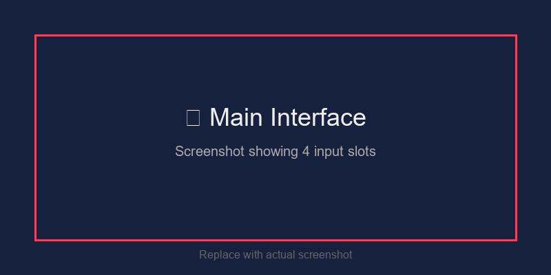
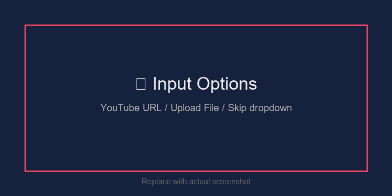
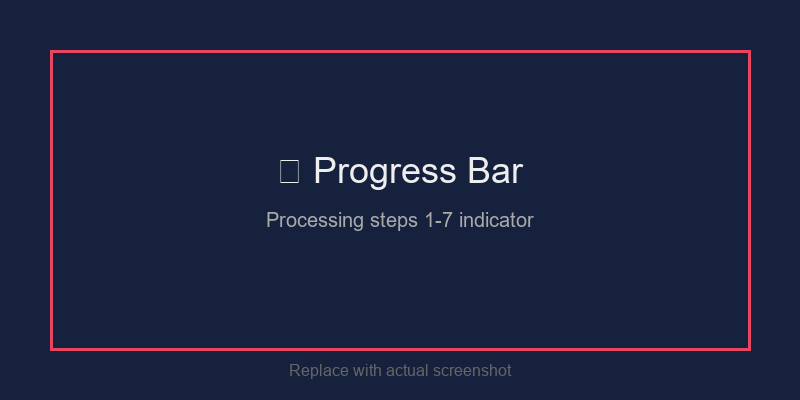
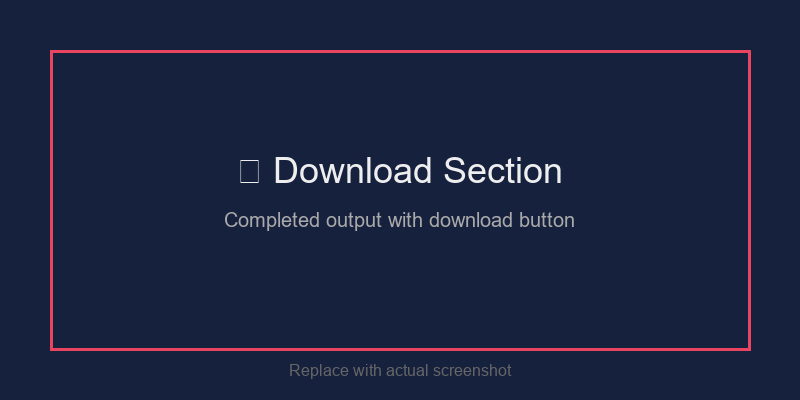

# Audio Mixer (Streamlit + ffmpeg + yt-dlp)

Create a simple, consumer‑grade audio sequence from up to four audio sources (YouTube URLs and/or uploaded files) and up to four local background tracks. No overlay/mixing: each background plays independently before its corresponding audio.


<!-- Replace with actual screenshot: streamlit run streamlit_app.py, then take screenshot of the main UI -->

---

## Table of Contents

- [What It Does](#what-it-does)
- [Requirements](#requirements)
- [Quick Start](#quick-start)
- [Screenshots](#screenshots)
- [Usage](#usage)
  - [Streamlit UI](#streamlit-ui)
  - [CLI](#cli)
- [Features](#features)
- [Project Structure](#project-structure)
- [Background Audio Files](#background-audio-files)
- [Quality Settings](#quality-settings)
- [Troubleshooting](#troubleshooting)

---

## What It Does

1. **Downloads** audio from YouTube URLs or **processes** uploaded audio files
2. **Adjusts** playback speed for all audio tracks (single slider applied to all)
3. **Applies** background volume adjustment (now fully functional!)
4. **Builds** this sequence for each i in 1..N (N ≤ 4):
   ```
   background_i → audio_i → silence (default 5s) → audio_i
   ```
5. **Concatenates** all segments into one output file

### Play Order Illustrated

For each audio source:
```
┌─────────────┐    ┌─────────┐    ┌─────────┐    ┌─────────┐
│ Background  │ →  │ Audio   │ →  │ Silence │ →  │ Audio   │
│   Track i   │    │   i     │    │  (5s)   │    │   i     │
└─────────────┘    └─────────┘    └─────────┘    └─────────┘
```

> Background tracks are **not mixed** under the audio; they are standalone segments that play before each audio track.

---

## Requirements

- **Python 3.9+**
- **ffmpeg** on PATH
- **yt-dlp** on PATH

### Install Python packages:

```bash
pip install streamlit yt-dlp
```

### Install ffmpeg:

**Windows (PowerShell with Chocolatey):**
```powershell
choco install ffmpeg
```

**macOS:**
```bash
brew install ffmpeg
```

**Linux:**
```bash
sudo apt install ffmpeg  # Debian/Ubuntu
sudo dnf install ffmpeg  # Fedora
```

---

## Quick Start

```bash
# Clone or download this repository
cd audio-mixer

# Run the Streamlit app
streamlit run streamlit_app.py
```

Then open your browser at `http://localhost:8501`

---

## Screenshots

### Main Interface

<!-- TODO: Screenshot showing the main UI with 4 input slots visible -->

### Input Options

<!-- TODO: Screenshot showing the dropdown: YouTube URL / Upload File / Skip -->

### Processing with Progress Bar

<!-- TODO: Screenshot showing the progress bar during processing -->

### Download Section

<!-- TODO: Screenshot showing the completed output with download button -->

> **Note:** To add screenshots, run `streamlit run streamlit_app.py`, then use your system's screenshot tool to capture the UI. Save images to `docs/images/` folder.

---

## Usage

### Streamlit UI

```bash
streamlit run streamlit_app.py
```

#### UI Controls:

| Control | Description |
|---------|-------------|
| **Input Sources** | Choose up to 4 audio sources, each can be: YouTube URL, Upload File, or Skip |
| **Speed** | Playback speed for all audio tracks (0.25x - 4.0x) |
| **Silence between repeats** | Seconds of silence between audio repeats (1s - 15s) |
| **Background volume (dB)** | Adjust background loudness (-40dB to +6dB). Negative = quieter, positive = louder |
| **Output format** | MP3 (default), WAV (lossless), or M4A |

#### New Features in UI:
- ✅ **YouTube URL validation** - Invalid URLs are caught before processing
- ✅ **File size limit** - Uploads limited to 100MB per file
- ✅ **Progress tracking** - 7-step progress bar shows current processing stage
- ✅ **Hybrid input support** - Mix YouTube URLs with uploaded files
- ✅ **Persistent download** - Download button remains available after processing

#### Example Input Combinations:
- Slot 1: YouTube URL, Slot 2: Upload File, Slot 3: Skip, Slot 4: YouTube URL
- All 4 slots: Upload Files
- All 4 slots: YouTube URLs
- Any combination you need!

---

### CLI

```bash
python yt_audio_mix.py <url1> <url2> <url3> <url4> \
  --speed 1.0 \
  --silence 5 \
  --bg-volume-db -6 \
  --bg-dir . \
  --out final_output.mp3
```

#### CLI Flags:

| Flag | Description | Default |
|------|-------------|---------|
| `urls` | YouTube URLs (1-4; extras ignored) | *(required)* |
| `--speed` | Playback speed multiplier (e.g., 1.25 = 25% faster) | 1.0 |
| `--silence` | Seconds of silence between repeats | 5.0 |
| `--bg-volume-db` | Background gain in dB (negative = quieter) | -6.0 |
| `--bg-dir` | Directory containing background files | `.` |
| `--out` | Output file path (.mp3/.wav/.m4a) | `final_output.wav` |
| `--keep-work` | Keep intermediate files for debugging | *(flag)* |

#### CLI Example:

```bash
# Basic usage - single YouTube video
python yt_audio_mix.py "https://youtube.com/watch?v=abc123" --out mix.mp3

# Multiple videos with custom speed and quieter backgrounds
python yt_audio_mix.py \
  "https://youtube.com/watch?v=video1" \
  "https://youtube.com/watch?v=video2" \
  --speed 1.25 \
  --bg-volume-db -12 \
  --silence 3 \
  --out workout_mix.mp3

# Keep working files for debugging
python yt_audio_mix.py "https://youtube.com/watch?v=xyz789" --keep-work --out debug.mp3
```

---

## Features

### ✅ Recently Added
- [x] **Background volume adjustment** - Now actually works via FFmpeg volume filter
- [x] **Uploaded file processing** - Mix YouTube URLs with local files
- [x] **YouTube URL validation** - Prevents invalid URLs from causing errors
- [x] **Progress tracking** - Visual progress bar in Streamlit UI
- [x] **File size validation** - 100MB limit with clear error messages
- [x] **Auto cleanup** - Temp directories cleaned up automatically
- [x] **Fixed CLI cleanup** - `--keep-work` flag works correctly now

### 🔧 Core Features
- Download YouTube audio (up to ~160 kbps for efficiency)
- Upload local audio files (MP3, WAV, M4A, AAC, FLAC, OGG, OPUS)
- Adjust playback speed (0.25x - 4.0x)
- Concatenate with background tracks
- Export to MP3, WAV, or M4A format

---

## Project Structure

```
audio-mixer/
├── streamlit_app.py          # Streamlit web interface
├── yt_audio_mix.py           # CLI tool and core functions
├── run_app.bat               # Windows batch launcher
├── background_audiofile_01.mp3  # Default background tracks
├── background_audiofile_02.mp3
├── background_audiofile_03.mp3
├── background_audiofile_04.mp3
├── README.md                 # This file
└── docs/
    └── images/               # Screenshots (add yours here)
        ├── banner.png
        ├── main-interface.png
        ├── input-options.png
        ├── progress-bar.png
        └── download-section.png
```

---

## Background Audio Files

Place your background tracks in the project folder (or use `--bg-dir`), named as follows:

```
background_audiofile_01.(wav|mp3|m4a|aac|flac|ogg|opus)
background_audiofile_02.(...)
background_audiofile_03.(...)
background_audiofile_04.(...)
```

Only the first N background files that exist will be used (where N = number of audio sources). Each background_i plays before its corresponding audio_i.

---

## Quality Settings

| Stage | Setting |
|-------|---------|
| **Download** | Best audio up to ~160 kbps (`bestaudio[abr<=160]/bestaudio`) |
| **Processing** | 44.1 kHz, 16-bit stereo PCM (internal) |
| **Output MP3** | 192 kbps, stereo |
| **Output M4A** | AAC 192 kbps, stereo |
| **Output WAV** | PCM 44.1 kHz, 16-bit stereo (lossless) |

To reduce file size further, edit `yt_audio_mix.py` and change the bitrate:
```python
# For MP3, change this line:
cmd += ["-c:a", "libmp3lame", "-b:a", "128k"]  # Was 192k
```

---

## Troubleshooting

### Common Issues

| Problem | Solution |
|---------|----------|
| "Missing required tool(s)" | Ensure `ffmpeg` and `yt-dlp` are installed and on PATH |
| "Invalid YouTube URL format" | Check that the URL starts with `https://youtube.com/watch?v=` or `https://youtu.be/` |
| "File too large" | Upload files smaller than 100MB |
| "No background audio files found" | Add `background_audiofile_01.mp3` (etc.) to the project folder |
| Audio too loud/quiet | Adjust the **Background volume (dB)** slider (negative = quieter) |
| PATH issues on Windows | Close/reopen your terminal after installing ffmpeg/yt-dlp |

### Debug Mode (CLI)

If processing fails, use `--keep-work` to inspect intermediate files:

```bash
python yt_audio_mix.py "https://..." --keep-work --out debug.mp3
```

The working directory path will be printed at the start of processing.

### Streamlit Logs

In the Streamlit UI, expand the log area below the Mix Audio button to see detailed FFmpeg and yt-dlp output.

---

## License

MIT License - Feel free to use and modify as needed.

---

## Contributing

1. Fork the repository
2. Create a feature branch
3. Make your changes
4. Submit a pull request

---

<p align="center">Made with 🎵 using Streamlit, FFmpeg, and yt-dlp</p>
